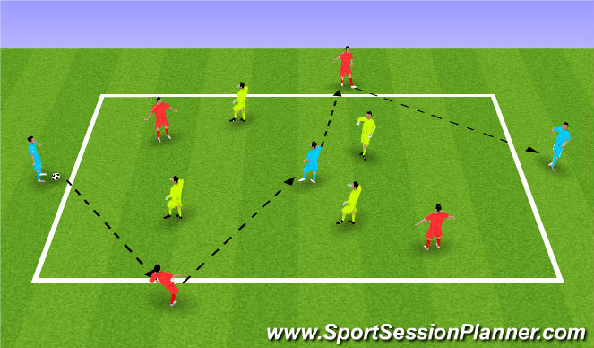

# Bài tập 4v4+3 của Guardiola

<iframe style="aspect-ratio: 16/9; width:100%" src="https://www.youtube.com/embed/PJo-JSbiTto" title="Positional Game   4v4 + 3 Neutral Players   BAYERN MUNICH   PEP GUARDIOLA TRAINING" frameborder="0" allow="accelerometer; autoplay; clipboard-write; encrypted-media; gyroscope; picture-in-picture; web-share" allowfullscreen></iframe>

## Nội Dung
- Thể loại: Trò chơi vị trí
- Số người chơi: 11 người chia thành 2 đội 4 người, 3 người trung lập
- Thời gian: 17 phút (5'/1'/5'/1'/5', 5 phút tập nghỉ1 phút)
- Kích thước vùng tập: 11x22(m)
- Cách chơi:
  - 3 người trung lập duy trì kiểm soát bóng với đội ở ngoài tạo thành
  đội 7 người (4+3).
  - Nếu/khi đội 4 người còn lại đoạt được bóng, sẽ có 1 khoảnh khắc
chuyển đổi trạng thái, 4 người này sẽ liên kết với 3 người trung lập và chiếm vị
trí ở ngoài

## Các khái niệm kỹ thuật và chiến thuật

### Tấn công

#### Về mặt kỹ thuật
- Truyền
- Cầm bóng 
- Di chuyển để mở ra 1 đường truyền
- Giao tiếp

#### Về mặt chiến thuật
- Duy trì quyền kiểm soát bóng 
- Hút người để tạo khoảng trống
- Truyền xuyên 1/nhiều tuyến phòng ngự
- Khái niệm người chạy thứ 3
- (qủa bóng) Lên, Về và Xuyên
- Bao phủ vị trí theo chiều rộng/chiều dài
- Triển khai lên bóng từ trong/ngoài
- Truyền bóng xuyên tuyến ở những độ cao khác nhau

### Phòng ngự

#### Về mặt kỹ thuật
- Hình dáng cơ thể (thế)
- Khi nào tắc bóng(là động tác trượt người hay bay người xoạc chân giành
  bóng từ chân đối thủ), chặn đường truyền, tỳ đè/tỳ đè trên không)
- Gây áp lực, bọc lót, hỗ trợ

#### Về mặt chiến thuật
- Chuyển trạng thái từ tấn công sang phòng ngự và ngược lại
- Thay đổi tâm thế
- Thu hẹp khoảng trống
- Gâp áp lực
- Chặn các đường truyền
- Phòng ngự có cấu trúc

### Tiêu chuẩn ban đầu khi cầu thủ mới làm quen với bài tập
- Thiếu tốc độ và mật độ cho các đường truyền
- Chậm truyển đổi
- Cả 2 đội đều không thể duy trì kiểm soát bóng tốt

## Tiến hành huấn luyện các khái niệm

- Thu hút người để tạo khoảng trống: Cầu thủ trung lập hút người tạo khoảng
  trống để triển khai bóng từ phía ngoài
- Duy trì kiểm soát bóng để tạo khoảng trống ở giữa: Cầu thủ trung lập ở một đầu
  sử dụng khoảng trống mà những cầu thủ bên ngoài đã tạo để truyền xuyên tuyến
phòng ngự
- (quả bóng) Lên, Về và Xuyên: Cầu thủ kiểm soát bóng chơi với cầu thủ gần nhất
  để giải phóng khoảng trống cho những đường truyền sâu hơn 
- Người chạy thứ 3: Đây là khái niệm quan trọng trong phong cách bóng đá theo vị
  trí và là cơ sở cho những "tam giác" trên sân 
- Thu hút đối thủ về khoảng trống của bạn để giải phóng đồng đội ở phía sau: Duy
  trì kiểm soát bóng ở khoảng cách gần để ảnh hưởng đến đon thủ và chuyển vùng
- Về mặt phòng thủ: Đóng lại những đường truyền. Gây áp lực lên cầu thủ đang cầm
  bóng trong khi đồng đội di truyển để đánh chặn
- Thay đổi tâm thế: Dù là sau khi đoạt được hay để mất bóng, tốc độ suy nghĩ khi
  thay đổi tâm thế là thiết yếu

<iframe style="aspect-ratio: 16/9; width:100%" src="https://www.youtube.com/embed/sVfQs-mEzJU" title="Vietsub | Development of Guardiola&#39;s 4v4+3 Juego de Posicion" frameborder="0" allow="accelerometer; autoplay; clipboard-write; encrypted-media; gyroscope; picture-in-picture; web-share" allowfullscreen></iframe>

## Khi các cầu thủ hiểu được bài tập
...

## Phân tích 1 bàn thắng. Quan sát những khái niệm trên trong 1 trận đấu
(Dịch chú thích)
Đây là khi chúng ta có thể thấy khái niệm thứ nhất: Thu hút đối thủ để chúng
  ta có thể triển khai bóng từ bên ngoài và Swansea đã bịmắc bẫy.
- Lần chạy này kéo thêm cầu thủ Swansea ra khỏi vịtrí tạo để tạo nhiều khoảng
  trống
- Bằng cách thu hút đối thủ pressing, Man City đã tạo khoảng trống đầu sau hàng
  phòng ngự
- Tiền vệ phòng ngự trung tâm của Man City đã cho cầu thủ tiền đạo của Swansea
  một "công tắc áp lực" bằng cách đứng ngoảnh mặt về phía khung thành và điều
này kéo cầu thủ Swansea ra khỏi vị trí
- Di chuyển lùi sau để tạo chiều rộng và đường truyền

Khái niệm thứ 2 và khái niệm then chốt: Lên, Xuống, Xuyên. Man City sử dụng 2
lần liên tiếp tạo ra một hiệu ứng hủy diệt. Nó cho phép họ không chỉ kéo Swansea
mà còn có thể tìm thấy đồng đội đứng sâu nhất một cách dễ dàng; điều này tạo
khoảng trống cho bàn thắng
